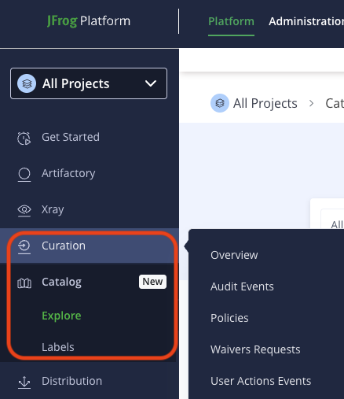
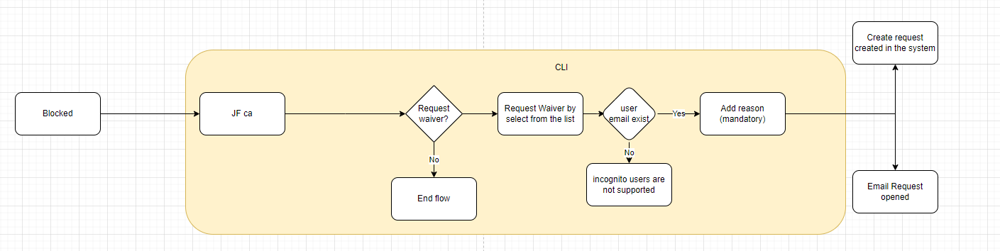
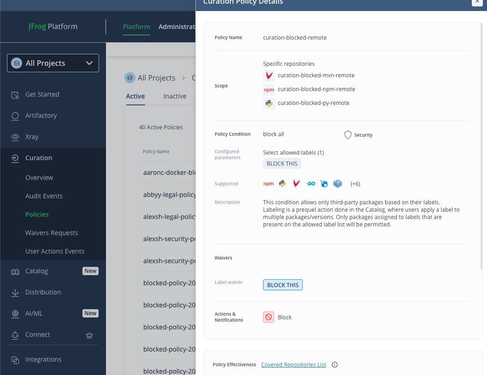
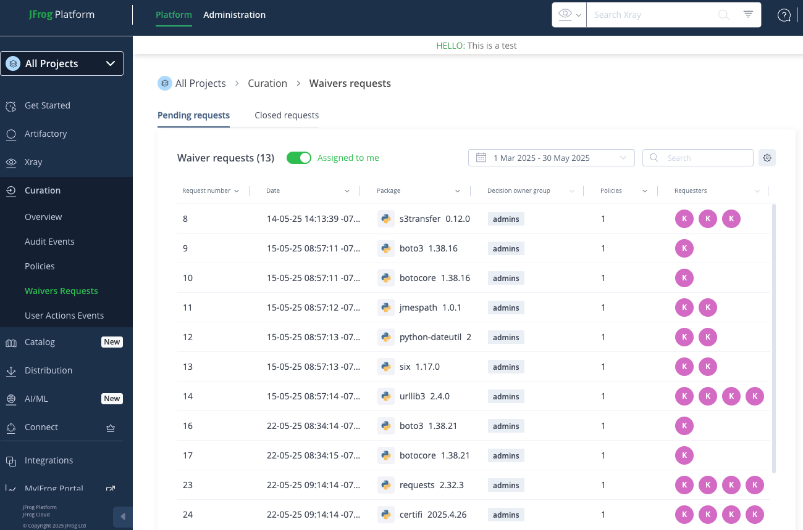
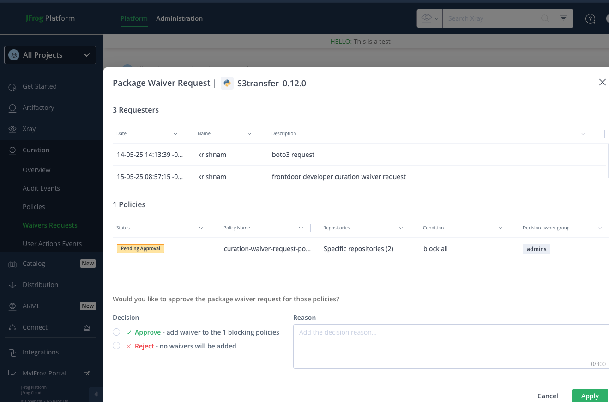
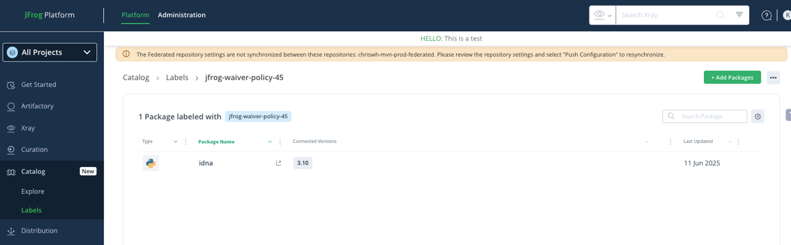

# Curation Waiver Request


<br /><br />
<span style="color:red;">NOTE: This feature is supported with the new Catalog service. Please validate whether your platform reflects a similar UI as shown below to ensure alignment and readiness</span>


<br />

Intead of running :
````
pip install -r requirements.txt
````

Do the following steps:

1. Configure the jfrog cli with your artifactory instance .
2. Modify the [jfcli.sh](jfcli.sh) script with:
- your artifactory instance
- `Remote` repository ( Example: Create remote repo 'curation-blocked-remote')
-  Create the Curation Blocking Policy ( see `"curation-blocked-remote"` in screenshots below)
- grant execute access to the script
- run it to  see `Curation Waiver workflow` in action.
```
chmod +x ./jfcli.sh
./jfcli.sh
```

## Screenshots

<br />

### Artifactory

<br />

<hr />

### Curation
#### Policy creation
[Manage Policies](https://jfrog.com/help/r/jfrog-security-user-guide/products/curation/manage-curation/manage-policies)


<br/>

<br/>

#### Waiver approval 
[Curation Waivers Approval Flow](https://jfrog.com/help/r/jfrog-security-user-guide/products/curation/manage-curation/manage-waivers)

If you `Approve` the `Waiver Request` for a  Curation Policy with Scope  `Organization-wide` or `Specific remote repositories`, then the Approved label
that gets created automatically  has the name in below format:
`jfrog-waiver-policy-<PolicyID>` . 

For example in above screenshot the label name `jfrog-waiver-policy-45` is created 
where `45` is the ID of the Curation policy `"curation-blocked-remote"`.



<br/>

<br/>

#### Approved label


<br/>

---

Ref: 
- [CTLG-851](https://jfrog-int.atlassian.net/browse/CTLG-851)
- [XRAY-83469](https://jfrog-int.atlassian.net/browse/XRAY-83469)
- [XRAY-122073](https://jfrog-int.atlassian.net/browse/XRAY-122073)


