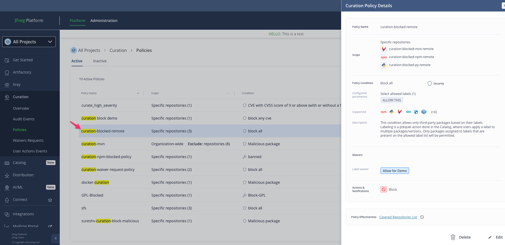
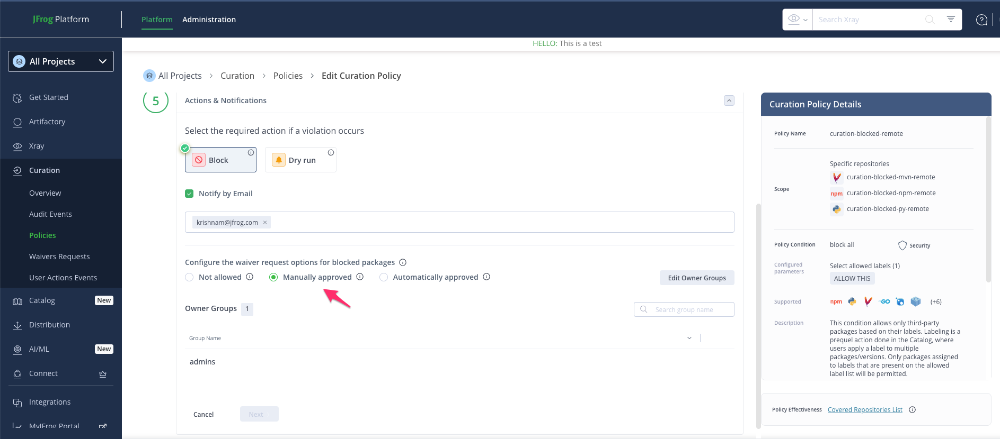

# Curation Waiver Request

- Create remote repo 'curation-blocked-remote'


````
pip install -r requirements.txt
````

## Screenshots
### Artifactory

<br />

<hr />

### Curation
#### Policy creation

<br/>

<br/>

#### Waiver approval 
[Curation Waivers Approval Flow](https://jfrog.com/help/r/jfrog-security-user-guide/products/curation/manage-curation/manage-waivers)

<br/>

<br/>

#### Approved label

<br/>

---
Ref: [CTLG-851](https://jfrog-int.atlassian.net/browse/CTLG-851)